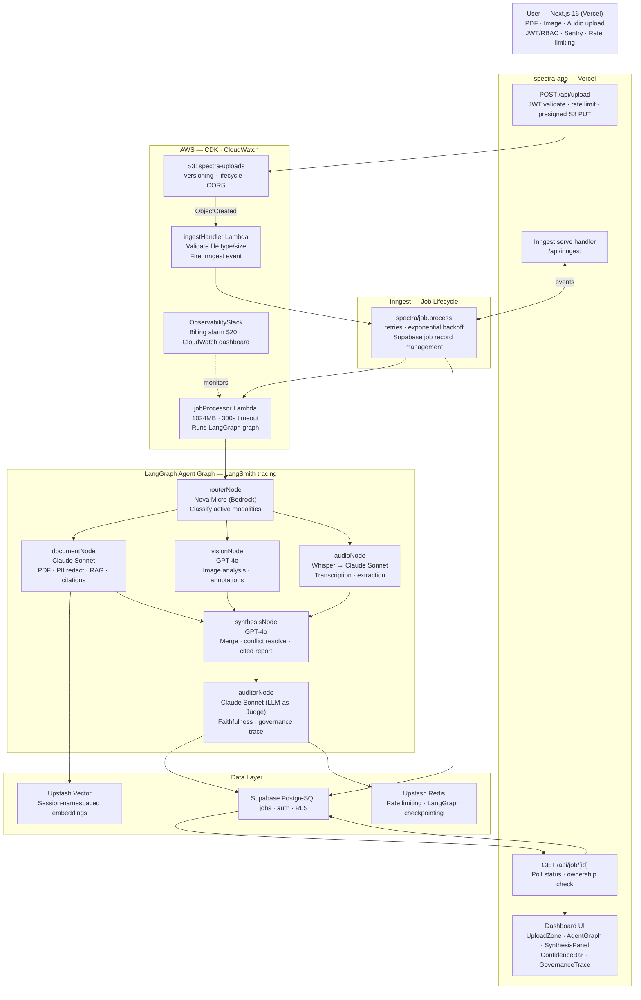
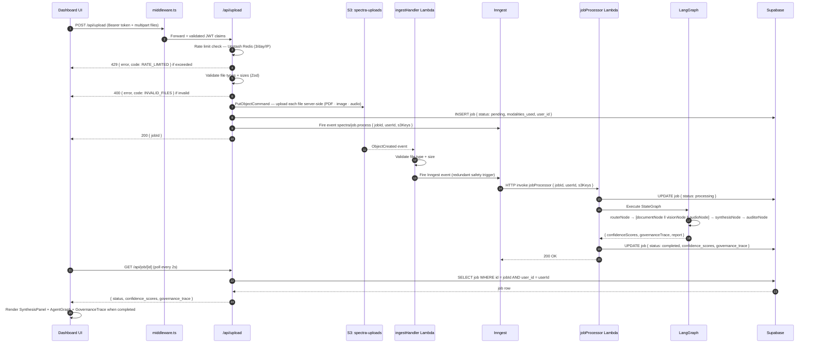
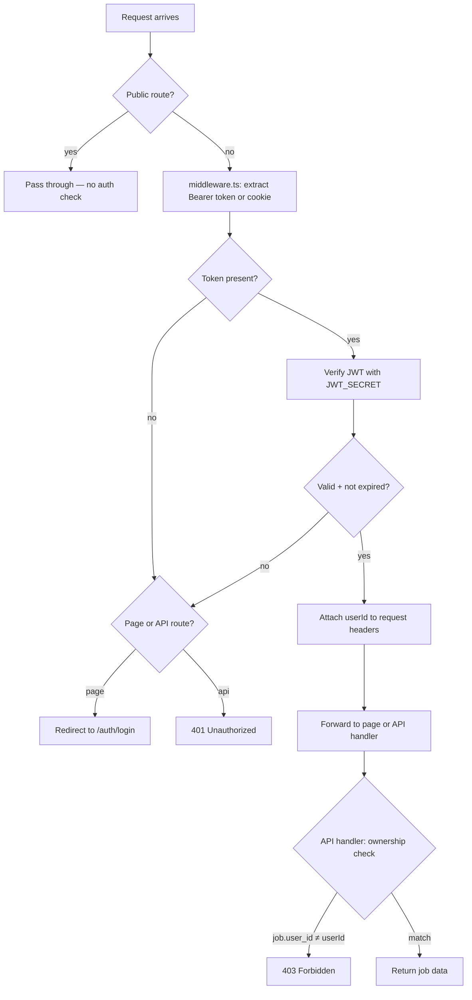
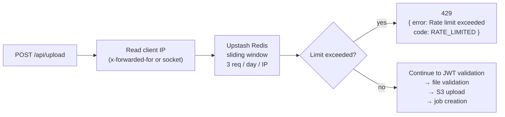
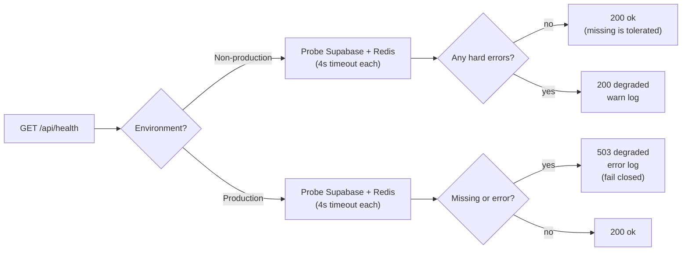
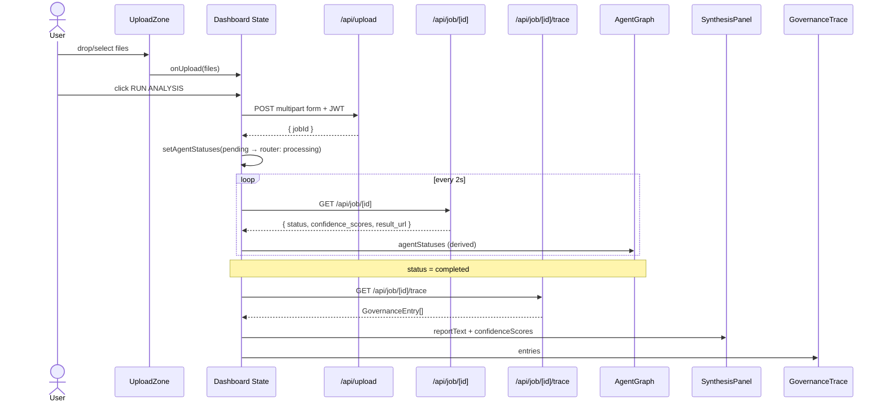

# 🌐 Spectra AI — Architecture Flows

This document captures the core runtime flows that define Spectra's current behavior.
Updated as each Phase ships — if a code change alters runtime behavior without updating this doc, treat that as an incomplete PR.

Use this file as the engineering source of truth for flow-level behavior.

---

## How to Read These Diagrams

- **UI** = dashboard and auth pages (Next.js 16, Vercel)
- **Middleware** = `middleware.ts` — JWT guard on all `/dashboard` and `/api` routes
- **/api/upload** = file validation, rate limiting, S3 presigned PUT, Inngest trigger
- **Inngest** = job lifecycle (pending → processing → completed/failed), retries
- **Lambda** = `ingestHandler` (S3 trigger) + `jobProcessor` (Inngest HTTP invocation)
- **LangGraph** = agent orchestration inside `jobProcessor`
- **Supabase** = job record storage, Auth, RLS
- **Upstash Redis** = rate limiting (frontend) + LangGraph checkpointing (Lambda)

Status code conventions used across flows:

- `400` malformed request payload
- `401` unauthenticated (missing or invalid JWT)
- `403` authenticated but not the job owner
- `429` rate limit exceeded (3 req/day/IP)
- `501` not yet implemented (scaffold phase)
- `503` critical runtime dependency unavailable (production strict mode)

---

## 1) Main System Architecture

### Diagram



---

## 2) Upload → Agent Pipeline Flow

### Why this exists

The upload path spans four systems (Next.js → S3 → Lambda → LangGraph → Supabase) and two async boundaries (S3 trigger, Inngest invocation). This diagram makes the hand-off points and failure modes explicit.

### What this flow guarantees

- Rate limit applied before any file processing — no backend cost on abuse.
- JWT ownership enforced at every API boundary.
- S3 receives files only after all validation passes.
- Job record created in Supabase before Lambda runs — frontend can poll immediately.
- Inngest owns retries; Lambda does not retry internally.
- Results written to Supabase atomically; frontend polls until `status === 'completed'`.

### Diagram



---

## 3) JWT Auth + Middleware Guard Flow

### Why this exists

Spectra separates unauthenticated public routes (landing, login) from protected dashboard and API routes. The middleware layer enforces this boundary before any page or handler executes.

### What this flow guarantees

- Unauthenticated users are redirected to `/auth/login` (pages) or receive `401` (API routes).
- Valid tokens pass actor identity through to downstream handlers for ownership checks.
- Public routes (`/`, `/auth/login`, `/api/auth/token`, `/api/inngest`, `/api/health`) are never blocked.

### Diagram



---

## 4) Rate Limiting Flow

### Why this exists

`/api/upload` triggers the full agent pipeline — Bedrock, OpenAI, Whisper, Lambda compute. Uncapped, a single abusive IP could drain the monthly cost ceiling in minutes. Rate limiting is the first check applied, before JWT validation or any file processing.

### What this flow guarantees

- 3 requests per day per IP, sliding window (Upstash Redis).
- Demo account subject to the same limit — no exceptions.
- Limit hit returns `429` immediately, no backend cost incurred.
- Real cost guard is the CloudWatch $20 billing alarm — rate limit is the first line of defence.

### Diagram



---

## 5) Runtime Strictness Policy (Health + Dependencies)

### Why this exists

Spectra must remain developer-friendly in non-production (missing env vars are tolerated) while being strict and predictable in production (missing or errored deps fail closed with `503`).

### What this flow guarantees

- Non-prod/CI allows degraded deps — supports local dev without all services wired.
- Production fails closed when Supabase or Redis are unavailable — no silent half-broken state.
- Health endpoint used by `scripts/verify-ready.mjs` and UptimeRobot.

### Diagram



---

## 6) Dashboard UI State Machine (Phase 3)

The dashboard manages a client-side state machine that drives all four output panels.

### State Variables

| State              | Type               | Description                                          |
| :----------------- | :----------------- | :--------------------------------------------------- |
| `files`            | `UploadedFiles`    | Files loaded into each drop target                   |
| `jobId`            | `string \| null`   | Supabase job UUID once upload succeeds               |
| `jobStatus`        | `JobStatus \| null`| `pending → processing → completed \| failed`         |
| `agentStatuses`    | `AgentStatuses`    | Per-node status derived from jobStatus (see below)   |
| `confidenceScores` | `ConfidenceScores` | `{ doc, vision, audio }` from Auditor node           |
| `governanceEntries`| `GovernanceEntry[]`| Full trace fetched on job completion                 |
| `reportText`       | `string`           | Synthesis report text from `job.result_url`          |

### Job Status → Agent Status Mapping

```
jobStatus = 'pending'    → router: processing, others: idle
jobStatus = 'processing' → router: complete, doc/vision/audio: processing, synthesis: idle
jobStatus = 'completed'  → all nodes: complete
jobStatus = 'failed'     → statuses frozen at last known state
```

### Flow Diagram



---

## 7) Phase 4 Observability + Test Architecture

### Sentry Integration Points

Two separate Sentry SDKs are in use — they cannot share config:

| Location | SDK | Init file |
| :--- | :--- | :--- |
| Next.js client (browser) | `@sentry/nextjs` | `sentry.client.config.ts` |
| Next.js server + edge | `@sentry/nextjs` | `sentry.server.config.ts`, `sentry.edge.config.ts` |
| Lambda (`jobProcessor`, `ingestHandler`) | `@sentry/aws-serverless` | module-level `Sentry.init()` + `Sentry.wrapHandler()` |

`withSentryConfig()` in `next.config.ts` handles source-map upload and build-time instrumentation. It wraps the exported `NextConfig` — the raw config is not exported.

### Test Suite Layout

```
apps/spectra-app/tests/
├── api/
│   ├── upload/route.test.ts      # Rate limiting, S3 upload, JWT, 400/429 paths
│   ├── job/route.test.ts         # Ownership enforcement, 401/403/200/404
│   └── auth/route.test.ts        # Credential validation, JWT issuance
└── e2e/
    ├── landing.spec.ts           # Public landing page smoke
    ├── login.spec.ts             # Auth flow
    └── dashboard.spec.ts         # Gated — requires PLAYWRIGHT_RUN_E2E=true + live Supabase

apps/spectra-api/src/__tests__/
└── schemas.test.ts               # 23 tests — all 6 agent node schemas (Router → Auditor)
```

Vitest picks up `**/*.test.ts` only. Playwright `.spec.ts` files are excluded from Vitest via explicit `exclude: ["tests/e2e/**"]` in `vitest.config.ts`.

Playwright `webServer` block starts the Next.js dev server and injects `NEXT_PUBLIC_SENTRY_DSN: ""` (prevents missing-DSN startup failure in CI) and a predictable `JWT_SECRET` so E2E helpers can issue valid tokens.

---

## 8) Phase 5 AWS Deployment Topology

### CDK Stack Deployment Order

Three stacks deploy in dependency order — CDK resolves this automatically via cross-stack exports:

```
SpectraStorageStack   → S3 bucket + lifecycle + CORS
SpectraComputeStack   → ingestHandler + jobProcessor Lambdas + IAM + Bedrock policy
SpectraObservabilityStack (us-east-1) → billing alarm + SNS + CloudWatch dashboard
```

The S3 → `ingestHandler` event notification is wired at app level (`bin/spectra-api.ts`) after both stacks are instantiated, avoiding a circular dependency between StorageStack and ComputeStack:

```ts
storageStack.uploadsBucket.addEventNotification(
  s3.EventType.OBJECT_CREATED,
  new s3n.LambdaDestination(computeStack.ingestHandler),
  { prefix: "uploads/" },
);
```

CDK exports the Lambda ARN from ComputeStack and imports it into the bucket notification in StorageStack. Deploy order: ComputeStack before StorageStack update.

### Lambda Configuration at Deployment

| Function | Memory | Timeout | Concurrency |
| :--- | :--- | :--- | :--- |
| `spectra-ingest-handler` | 256 MB | 30s | unreserved |
| `spectra-job-processor` | 1024 MB | 300s | `reservedConcurrentExecutions: 1` |

`jobProcessor` concurrency is capped at 1 deliberately — prevents parallel runs stacking Bedrock + OpenAI + Anthropic costs during the demo period. A throttled second invocation is retried by Inngest with exponential backoff.

### Billing Alarm

CloudWatch `EstimatedCharges` metric lives in `us-east-1` regardless of the app region. `ObservabilityStack` deploys to `us-east-1` specifically for this reason. The SNS topic (`spectra-billing-alerts`) sends an email to the configured `BILLING_ALERT_EMAIL` when estimated monthly charges hit $20.

---

## Update Rules

Update this document whenever any of the following changes:

- Upload pipeline hand-off points or validation order
- Rate limiting algorithm, threshold, or scope
- JWT verification logic or protected route set
- Dependency strictness policy or health endpoint semantics
- Agent graph execution order or node responsibilities

---

## Suggested Companion Docs

- `ARCHITECTURE.md` — component responsibilities, model-to-task mapping, infrastructure decisions
- `CLAUDE.md` — development governance, build phases, TypeScript rules
- `TECHNICAL_ADVISORY.md` — architecture tradeoffs and cost decisions *(created after Phase 5)*
- `HARDENING_ROADMAP.md` — post-launch hardening checklist *(created after Phase 5)*
