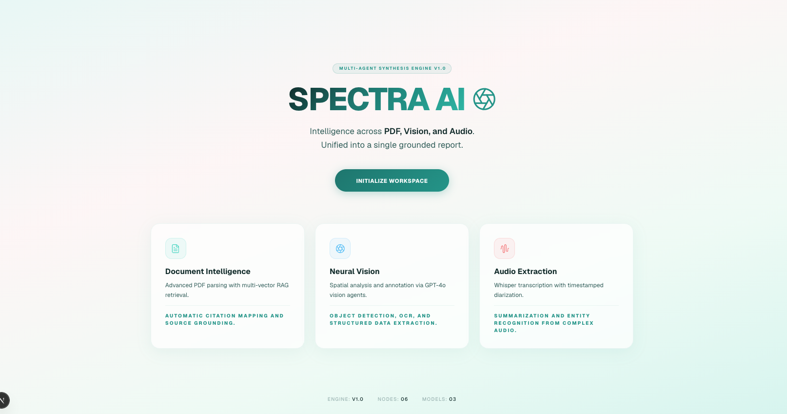
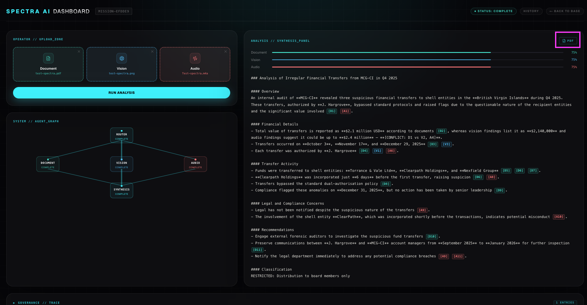
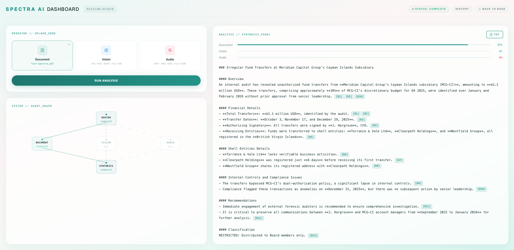
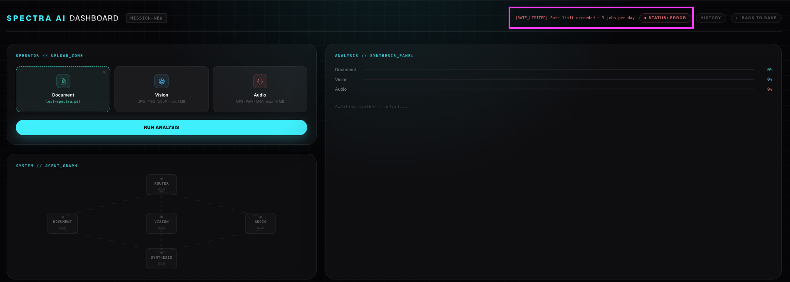
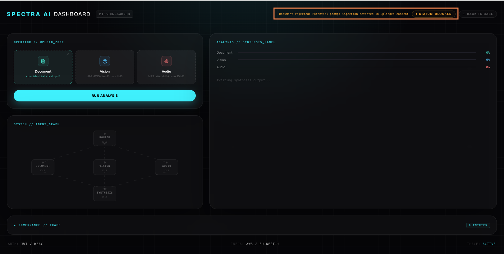
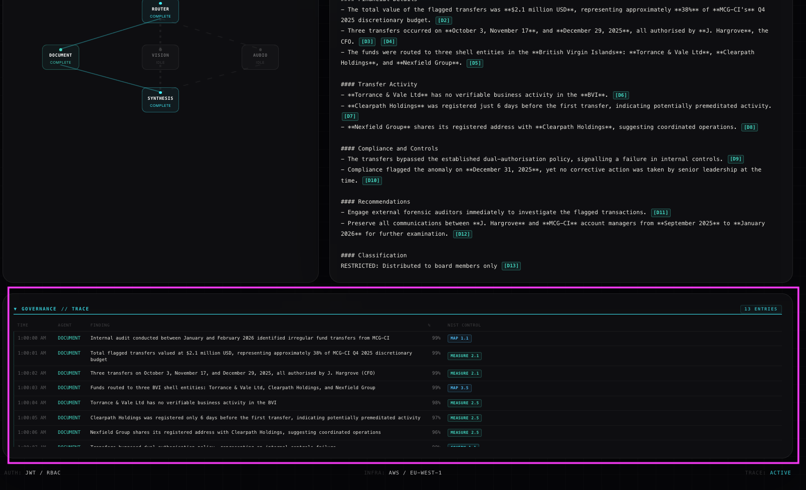
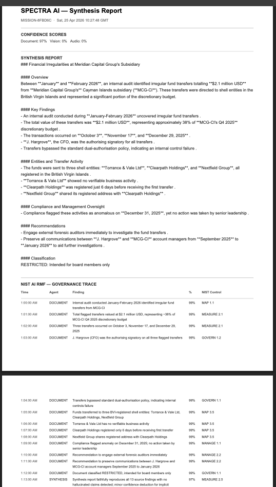
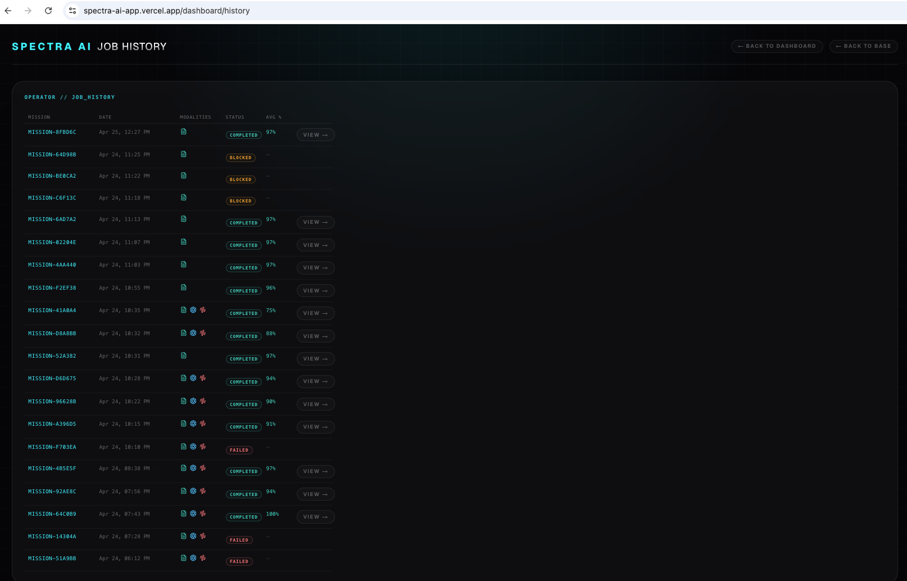
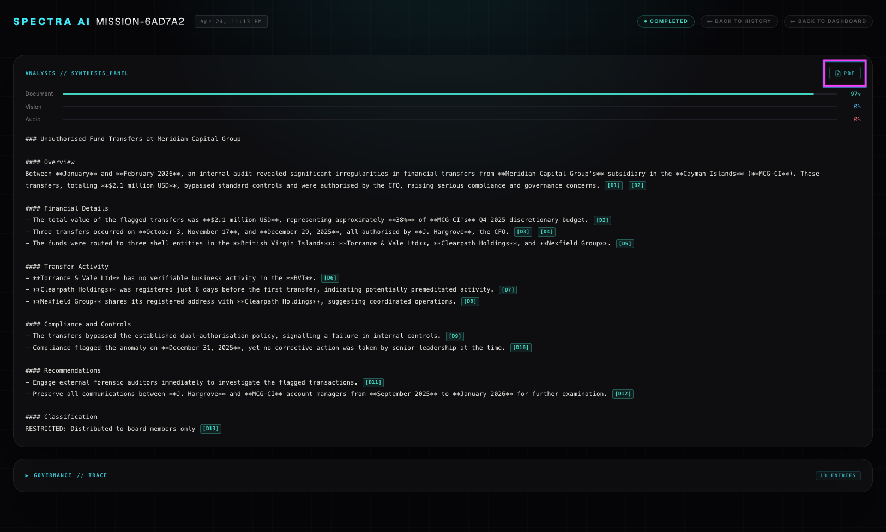

# 🌐 Spectra AI: Multimodal Intelligence Agent

**[🚀 View Live Demo](https://spectra-ai-app.vercel.app/)** | **[📂 View Codebase](https://github.com/GeorgiDS9/spectra-ai)**

**Multimodal AI | Multi-Agent Graph | LangGraph Orchestration | LLM-as-Judge Auditor | NIST AI RMF Governance**

**Spectra AI** is a governance-first multimodal intelligence agent built on **NIST AI Risk Management Framework**. It routes **documents, images, and audio** through a specialist multi-agent graph — processing all three modalities in parallel, merging findings into a single grounded cited report, and scoring the synthesis for faithfulness with an LLM-as-Judge Auditor. Every job produces an auditable governance trace with NIST control IDs (GOVERN / MAP / MEASURE / MANAGE), enabling compliance investigations and risk traceability from finding to control.

The premise is that real-world intelligence problems are never single-modality. A security analyst gets a PDF report, a screenshot of an anomaly, and a voice memo from a colleague — and has to reason across all three simultaneously. Spectra ingests all three, routes each to a specialized agent, and a synthesis layer produces a single cited output with the reasoning process visible live in the UI — while maintaining an immutable audit trail.

Built on **LangGraph**, **Claude Sonnet**, **GPT-4o**, and **Whisper**, with **AWS infrastructure** (S3, Lambda, Bedrock), **Inngest** for job orchestration, and a **live agent status dashboard** streaming results in real time. Deployed as two independently deployable units — **spectra-app** (Next.js 16 on Vercel) and **spectra-api** (AWS CDK + Lambda). Governance-focused: NIST AI RMF alignment, SOC 2 subprocessors, PII redaction, RLS, LangSmith tracing.

---

## 🏗️ Core Architecture

### Folder Structure

```
spectra-ai/
├── apps/
│   ├── spectra-app/              Next.js 16 frontend on Vercel
│   │   ├── app/                  App Router: pages, layouts, API routes
│   │   ├── components/           Reusable React components
│   │   ├── lib/                  Utilities: API client, types, constants
│   │   └── middleware.ts         JWT guard for /dashboard and /api
│   ├── spectra-api/              AWS CDK + Lambda backend
│   │   ├── bin/                  CDK entry point
│   │   ├── lib/stacks/           CDK stack definitions
│   │   ├── src/
│   │   │   ├── handlers/         Lambda entry points (ingestHandler, jobProcessor)
│   │   │   ├── graph/            LangGraph agent orchestration + nodes
│   │   │   └── lib/              Shared schemas (Zod), utilities, SQL
│   │   ├── migrations/           Supabase SQL migrations
│   │   └── .env.example          Environment template
│   └── .prettierrc                Prettier config (shared across apps)
├── docs/                          Architecture & operations documentation
├── .husky/                        Git pre-commit hooks
├── package.json                   Root dev dependencies (husky, lint-staged, prettier)
└── CLAUDE.md                      Project rules & architecture constraints
```

Each app is independently deployable. Spectra-app deploys to Vercel; spectra-api deploys via CDK to AWS.

### Infrastructure

```
spectra-app (Vercel)                     spectra-api (AWS)
──────────────────────                   ─────────────────────────────
Next.js 16 App Router                    CDK: StorageStack + ComputeStack
Vercel AI SDK (streaming)                S3: spectra-uploads (versioned)
JWT/RBAC middleware                      Lambda: ingestHandler (S3 trigger)
Inngest serve handler                    Lambda: jobProcessor (Inngest HTTP)
Upstash rate limiting                    Bedrock: Nova Micro (Router only)
Supabase client (polling)                LangGraph (inside jobProcessor)
                                         Upstash Vector (session embeddings)
                                         Upstash Redis (checkpointing)
                                         LangSmith (end-to-end tracing)
                                         CloudWatch (billing alarm + dashboard)
```

For the full runtime flows, sequence diagrams, and infrastructure decisions see [ARCHITECTURE_FLOWS.md](./docs/ARCHITECTURE_FLOWS.md).

### Agent Graph

```
routerNode (Nova Micro / Bedrock)
    ↓
[documentNode (Claude Sonnet) ‖ visionNode (GPT-4o) ‖ audioNode (Whisper → Sonnet)]
    ↓  parallel, conditional on active modalities
synthesisNode (GPT-4o)
    ↓
auditorNode (Claude Sonnet — LLM-as-Judge)
    ↓
write to Supabase
```

---

## 🛠️ Tech Stack

| Area              | Technology                                                                                                                                                                                                                   |
| :---------------- | :--------------------------------------------------------------------------------------------------------------------------------------------------------------------------------------------------------------------------- |
| Frontend          | Next.js 16 App Router · React 19 · TypeScript · Tailwind CSS 4 · Lucide Icons · AI SDK                                                                                                                                       |
| Backend IaC       | AWS CDK (TypeScript)                                                                                                                                                                                                         |
| Compute           | AWS Lambda (Node.js 20.x)                                                                                                                                                                                                    |
| AI Routing        | AWS Bedrock — Nova Micro (`amazon.nova-micro-v1:0`)                                                                                                                                                                          |
| Agent Graph       | LangGraph (TypeScript) — StateGraph · Parallel Branching · Checkpointing                                                                                                                                                     |
| Parsing & Export  | pdf2json (Ingestion) · jspdf (Export)                                                                                                                                                                                        |
| Validation        | Zod (Strict schema enforcement)                                                                                                                                                                                              |
| Tracing           | LangSmith (End-to-end agent graph tracing · Standardized via @langchain/core )                                                                                                                                               |
| Models            | Claude Sonnet · GPT-4o · Whisper · Nova Micro                                                                                                                                                                                |
| Embeddings        | text-embedding-3-small                                                                                                                                                                                                       |
| Vector Store      | Upstash Vector (Session-namespaced retrieval)                                                                                                                                                                                |
| Database          | Supabase PostgreSQL (Relational schema + RLS)                                                                                                                                                                                |
| Auth & Security   | Supabase Auth · jose (Edge-JWT) · RBAC Middleware                                                                                                                                                                            |
| Job Orchestration | Inngest (Event-driven, retries, state tracking)                                                                                                                                                                              |
| Rate Limiting     | Upstash Redis (Sliding window per IP)                                                                                                                                                                                        |
| Error Tracking    | Sentry (Full-stack: Client + Server + Lambda)                                                                                                                                                                                |
| Testing           | Vitest (Unit) · Red Teaming (Adversarial Suite) · Playwright (E2E)                                                                                                                                                           |
| CI/Workflows      | GitHub Actions ([ci.yml](README.md#ciyml--pull-request-quality-gates), [scheduled-audit.yml](README.md#scheduled-audityml--dependency-security-audit), [ping-supabase.yml](README.md#ping-supabaseyml--supabase-keep-alive)) |

---

## 🔒 Model-to-Task Mapping

Spectra AI deliberately matches model capability to task rather than defaulting to a single provider:

| Agent     | Model                   | Rationale                                                               |
| :-------- | :---------------------- | :---------------------------------------------------------------------- |
| Router    | Nova Micro (Bedrock)    | Classification only — cheapest correct model, no reasoning depth needed |
| Document  | Claude Sonnet           | RAG + grounded citation extraction — Anthropic's core strength          |
| Vision    | GPT-4o                  | Best native image understanding available — non-negotiable              |
| Audio     | Whisper → Claude Sonnet | Transcription (Whisper) + structured extraction (Sonnet)                |
| Synthesis | GPT-4o                  | Multi-source merging and conflict resolution                            |
| Auditor   | Claude Sonnet           | Faithfulness + hallucination detection — Anthropic's core strength      |

---

## 🧱 Build Phases

| Phase | Area                                                                          | Status      |
| :---- | :---------------------------------------------------------------------------- | :---------- |
| 1     | Monorepo shell + CDK scaffold + Next.js scaffold                              | ✅ Complete |
| 2     | LangGraph agent graph + Inngest + API surface                                 | ✅ Complete |
| 3     | UploadZone + AgentGraph + SynthesisPanel + GovernanceTrace                    | ✅ Complete |
| 4     | Integration + hardening (JWT/RBAC, PII redaction, Sentry, Vitest, Playwright) | ✅ Complete |
| 5     | AWS deployment (cdk deploy, concurrency limit, UptimeRobot)                   | ✅ Complete |

---

## 📊 Evals & Quality Assurance

Spectra AI implements a three-layer evaluation framework to measure synthesis quality, faithfulness, and hallucination risk at runtime and in CI. Every job is scored by an LLM-as-Judge Auditor (Claude Sonnet) producing per-modality confidence scores and a governance trace with NIST AI RMF tags. Programmatic evaluators emit structured quality metrics to LangSmith for real-time tracking, and golden-set Vitest tests validate retrieval pipeline quality offline with no API calls. _(Detailed evaluation architecture maintained locally to protect tactical defense mechanism details.)_

See [EVALUATION_AND_CONTROLS.md](./docs/EVALUATION_AND_CONTROLS.md) for the full three-layer evaluation architecture, control metrics, and quality gates. _This document is maintained locally and intentionally not published to prevent detailed red-teaming methodology from being publicly available._

---

## 🛡️ Guardrails & Defense Mechanisms

Spectra AI enforces multi-stage guardrails to prevent prompt injection, PII leakage, and synthesis drift. All inputs are scanned before routing to agents; five PII pattern types (email, phone, SSN, credit card, UK NINO) are redacted before vectorization; synthesis output is validated for length, injection re-check, and citation presence; and access is protected by per-IP rate limiting, session-namespaced vector retrieval, and hard billing ceiling at $15/month.

See [EVALUATION_AND_CONTROLS.md](./docs/EVALUATION_AND_CONTROLS.md) for complete guardrail specifications, test coverage, and defense-in-depth rationale. _Maintained locally, not public_.

---

## ⚖️ Compliance & Data Governance

Spectra AI is architected around **NIST AI Risk Management Framework** (GOVERN / MAP / MEASURE / MANAGE) and designed for regulatory compliance across GDPR, EU AI Act, CCPA/CPRA, and HIPAA-adjacent use cases.

**Governance & Transparency:**

- Every job produces an auditable **governance trace** with NIST control IDs, agent findings, confidence scores, and timestamps
- PII is redacted before processing (5 patterns: email, phone, SSN, credit card, UK NINO)
- Users control their data via **Supabase RLS** (row-level security)
- Model choices documented with capabilities, limitations, and bias mitigation per task

**Data Protection:**

- Subprocessors (Anthropic, OpenAI, AWS) are SOC 2 Type II compliant
- Users processing regulated data must sign Data Processing Agreements
- Audit trail via Supabase + Sentry + LangSmith for compliance investigations

See [COMPLIANCE.md](./docs/COMPLIANCE.md) for NIST AI RMF alignment, regulatory landscape, model governance & model cards, data governance policies, audit trail specifications, and risk assessment framework.

---

## 🥊 Red-Team Validation

Spectra AI ships with a structured adversarial test suite (`red-team.test.ts` — 48 tests) covering three security-critical controls:

- **Prompt injection detection** — 14 regex patterns, case-insensitive, tested against known attack variants (override instructions, jailbreak tokens, model-specific delimiters) buried in otherwise legitimate document text.
- **PII redaction coverage** — five pattern types (email, US phone, SSN, credit card, UK NINO), verified against false positives, duplicate labelling, and clean-text passthrough.
- **Synthesis output guardrails** — length floor, injection re-check on LLM output, and citation tag presence validated before the auditor receives the report.

See [`SECURITY_ADVISORY.md`](./docs/SECURITY_ADVISORY.md) for adversarial test scenarios, observed defences, and security control evidence. _This document is maintained locally and intentionally not published to prevent detailed red-teaming methodology from being publicly available._

---

> [!TIP]
>
> **Documentation Portal:**
>
> **[DEPLOYMENT_GUIDE.md](./docs/DEPLOYMENT_GUIDE.md)** — Complete deployment walkthrough for AWS (Lambda/CDK) + Vercel. Covers environment setup, backend/frontend deployment, database migrations, CI/CD workflows, monitoring (CloudWatch, LangSmith, Sentry), cost management, and troubleshooting. Start here for production deployments.
>
> **Architecture, Security & Compliance Context:**
>
> For runtime flow diagrams covering the upload pipeline, parallel multi-agent LangGraph execution, JWT auth guard, rate limiting, and AWS deployment topology, see [ARCHITECTURE_FLOWS.md](./docs/ARCHITECTURE_FLOWS.md).
>
> For engineering rationale behind model-to-task selection, S3 pre-signed URL architecture, Upstash deduplication tradeoffs, and CDK cross-stack wiring decisions, see [TECHNICAL_ADVISORY.md](./docs/TECHNICAL_ADVISORY.md).
>
> For the three-layer evaluation framework (LLM-as-Judge, programmatic evaluators, retrieval golden-set tests) and guardrail specifications (injection detection, PII redaction, synthesis validation, rate limiting), see [EVALUATION_AND_CONTROLS.md](./docs/EVALUATION_AND_CONTROLS.md). _Maintained locally to protect tactical evaluation and defense mechanism details._
>
> For regulatory compliance (GDPR, EU AI Act, CCPA), model governance & model cards, data governance, audit trail specifications, and risk assessment framework, see [COMPLIANCE.md](./docs/COMPLIANCE.md).
>
> For adversarial test scenarios, observed defences, and security control evidence, see [SECURITY_ADVISORY.md](./docs/SECURITY_ADVISORY.md). _Maintained locally and intentionally not published to prevent detailed red-teaming methodology from being publicly available._
>
> For the AI engineering hardening roadmap — security controls, observability improvements, retrieval quality, and maturity grades across 7 AI engineering skills — see [HARDENING_ROADMAP.md](./docs/HARDENING_ROADMAP.md).
>
> For health semantics, Lambda failure modes, CDK deployment steps, and rollback guidance, see [OPERATIONS_RUNBOOK.md](./docs/OPERATIONS_RUNBOOK.md).

---

## 🧭 Engineering Philosophy

Spectra AI demonstrates that multi-agent architecture is a requirement when modalities genuinely differ — not a label applied for effect. Each specialist has its own tool set, failure modes, and output schema. The two-tier hierarchy (Router + Synthesis as orchestrators, specialists as executors) reflects how the problem actually decomposes.

The infrastructure tradeoffs are deliberate: LangGraph over Step Functions (no point orchestrating an orchestrator), Inngest over SQS (job lifecycle management, not a raw queue), Upstash Vector over OpenSearch (portfolio-scale cost ceiling), Bedrock scoped to Nova Micro (cheapest correct model for classification, everything else via direct SDK).

## The $15/month CloudWatch billing alarm is the real cost guard — not the rate limit.

---

## 🧐 What Makes Spectra AI Genuinely Multi-Agent

Spectra is not multi-agent by label — the architecture requires it by design. Each modality has meaningfully different processing logic, tool use, and failure modes. A single agent handling all three would be a bloated prompt with no separation of concerns.

1. **Router Agent (Nova Micro / Bedrock):** Receives the raw inputs, classifies which modalities are present, and delegates to the right specialist nodes via LangGraph parallel branching. Cost-optimized — classification only.

2. **Document Agent (Claude Sonnet):** PDF parsing, chunking, PII redaction before vectorization, RAG retrieval from Upstash Vector under a session-namespaced key, citation extraction with page references.

3. **Vision Agent (GPT-4o):** Native image understanding, entity extraction, structured annotations, bounding descriptions. GPT-4o is materially stronger here — no compromise.

4. **Audio Agent (Whisper → Claude Sonnet):** Whisper transcription followed by Claude Sonnet structured extraction. Not an LLM reasoning task — transcription first, then structured output.

5. **Synthesis Agent (GPT-4o):** Receives all specialist outputs, merges findings, detects and flags contradictions between modalities (`[CONFLICT: D1 vs V2]`), generates a unified cited report with `[D1]`, `[V2]`, `[A1]` source tags.

6. **Auditor (Claude Sonnet — LLM-as-Judge):** Scores the synthesis for faithfulness, hallucination, and grounding per modality. Produces a governance trace entry per finding with a NIST AI RMF tag. Always runs last.

Router and Synthesis are the orchestration layer. The three specialists are the execution layer. That is a clean two-tier hierarchy.

---

## 📹 Operational Demo

### Full product walkthrough: Landing Page → Dashboard (Upload & Run) → Synthesis Report + Governance Trace → Job History → Job Detail

> [!TIP]
> **Watch the Spectra Pipeline in Action:** Click the link below to view the high-resolution operational walkthrough—covering the landing sequence, parallel multi-agent execution, live graph updates, and the final synthesis report.
>
> **[▶️ Spectra AI: Operational Demo Walkthrough](https://github.com/GeorgiDS9/spectra-ai/releases/download/v0.1.0-demo/spectra-ai-demo.mov)**

---

## 🖼️ Spectra AI Product Snapshot

### Landing Page

> 

### Dashboard

> Processed Job - All 3 Modalities

> 

> Processed Job - One Modality (PDF)

> 

> Error Status - Rate Limit

> 

> Blocked Status — Prompt Injection Detection

> 

> Governance Trace

> 

> Job PDF Download

> 

### Job History

> 

### Job Detail Page

> 

---

## 🔍 What Spectra Does

At runtime, Spectra:

- **Accepts file uploads** from the user — PDF, image, audio (up to 2 MB / 1 MB, or preset sample files).
- **Routes each file** to its specialist agent via LangGraph parallel branching.
- **Streams the synthesis report** progressively to the UI via Vercel AI SDK.
- **Shows the agent graph live** — which node is processing, which is complete, which is idle.
- **Scores the output** per modality (Document / Vision / Audio confidence %) via the LLM-as-Judge Auditor.
- **Produces a governance trace** — per-finding decision log with NIST AI RMF tags (GOVERN / MAP / MEASURE / MANAGE).
- **Flags conflicts** between modalities in the report: `[CONFLICT: D1 vs V2]`.
- **Isolates retrieval per session** — Upstash Vector namespaced by `{jobId}_{userId}`.
- **Redacts PII** before vectorization (Document Agent).
- **Persists job history** — past runs stored in Supabase, accessible from the History page with links to per-job synthesis and governance detail.

---

## 🧾 What Spectra Produces

### 1) Synthesis Report

Streaming markdown with inline citation badges — `[D1]` (teal), `[V2]` (sky blue), `[A1]` (coral). Each claim tagged to its modality source. Conflicts flagged inline.

The report can be downloaded as a PDF which contains these sections:

- Header — "SPECTRA AI — Synthesis Report", mission ID, timestamp
- Confidence Scores — Document / Vision / Audio percentages
- Synthesis Report — full text, citation tags stripped
- NIST AI RMF — Governance Trace — table with time, agent, finding, confidence %, and NIST control ID — only appears if there are entries

### 2) Per-Modality Confidence Scores

Three percentage scores from the LLM-as-Judge Auditor: Document, Vision, Audio — rendered as labeled horizontal bars in their modality colors.

### 3) Governance Trace

A decision log table — per-finding entries with timestamp, agent, finding summary, confidence score, and NIST AI RMF tag (GOVERN / MAP / MEASURE / MANAGE). Collapsed by default, expandable. Included in the PDF export.

### 4) Job History & Detail View

History page lists past runs with mission ID, date, modalities used, status, and average confidence. Completed jobs link to a full detail view showing the synthesis report, confidence bars, governance trace, and PDF download — all re-rendered from persisted Supabase state.

---

## 🎯 How to Use Spectra

### Supported File Types

| Modality     | Formats                          | Max Size |
| :----------- | :------------------------------- | :------- |
| **Document** | `.pdf`                           | 2 MB     |
| **Vision**   | `.jpg`, `.jpeg`, `.png`, `.webp` | 1 MB     |
| **Audio**    | `.mp3`, `.wav`, `.m4a`, `.ogg`   | 10 MB    |

### Usage Steps

1. Upload one or more files — PDF, image, audio. Or use the preset sample files (no upload needed).
2. Click **Run Analysis**.
3. Watch the agent graph update live as each specialist node processes its input.
4. Read the synthesis report with inline citations and conflict flags.
5. Review the confidence scores and governance trace at the bottom.
6. Download the full report as PDF, or navigate to **History** to review past runs and re-open any completed job.

> **Tips for best results**
>
> - Upload content that covers the **same topic across modalities** — a PDF report, a screenshot of a chart from that report, and a voice note summarising it. The synthesis layer is designed to merge and cross-reference, so unrelated files will produce a shallow output.
> - The Document agent runs RAG over the PDF — longer, denser documents produce richer citations than single-page files.
> - Audio works best with clear speech under 30 seconds. Whisper handles accents and technical vocabulary well; heavy background noise degrades transcription quality.
> - You can upload a single modality if that is all you have — the graph skips inactive nodes automatically.
> - Rate limit is **3 runs/day/IP** — plan your uploads before hitting Run.

### 🔐 Demo Access

```
Email:    demo@spectra.app
Password: spectra-demo
```

The demo account is a regular user. No special permissions. Rate limit: 3 runs/day/IP.

---

## 🚦 Getting Started (Local Development)

### Prerequisites

- **Node.js 20+**
- **Git** (for repository management)

For **production deployment**, see [DEPLOYMENT_GUIDE.md](./docs/DEPLOYMENT_GUIDE.md) for full setup instructions including AWS, Supabase, Upstash, and CI/CD.

### Setup

1. **Install root dependencies** — this wires up Husky pre-commit hooks for auto-formatting:

```bash
npm install
```

From this point, every `git commit` auto-formats staged `.ts`/`.tsx` files with Prettier.

2. **Frontend only** (fastest for UI development):

```bash
cd apps/spectra-app
cp .env.example .env.local
# Fill in Supabase credentials (anon key, URL) — see .env.example for details
npm install
npm run dev
```

Visit `http://localhost:3000`. You can test UI flows locally without a deployed backend (rate limiting and file uploads won't work without AWS/Upstash, but routing and component behavior can be tested).

3. **Full stack** (frontend + backend):

See [DEPLOYMENT_GUIDE.md](./docs/DEPLOYMENT_GUIDE.md#backend-deployment-spectra-api) for backend setup with CDK and Supabase migrations.

---

## 📦 Deployment

**For AWS + Vercel deployment instructions**, see [DEPLOYMENT_GUIDE.md](./DEPLOYMENT_GUIDE.md).

The guide covers:

- ✅ Environment setup for both apps
- ✅ AWS CDK backend deployment (Lambda, S3, IAM)
- ✅ Supabase migrations
- ✅ Vercel frontend deployment
- ✅ GitHub Actions CI/CD workflows
- ✅ Monitoring (CloudWatch, LangSmith, Sentry)
- ✅ Cost management & troubleshooting

**Key characteristic:** **Fully automatic** — no side effects, idempotent, no human action required.

---
