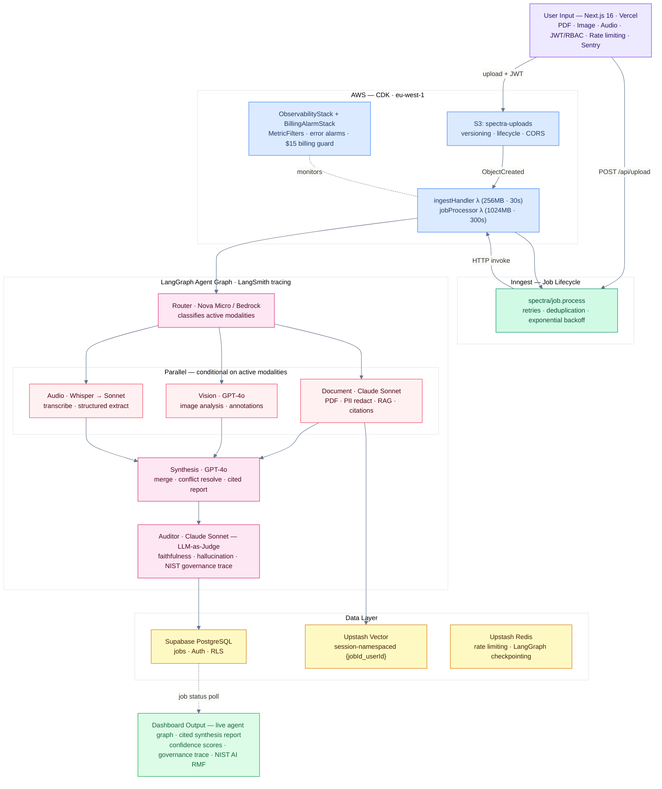
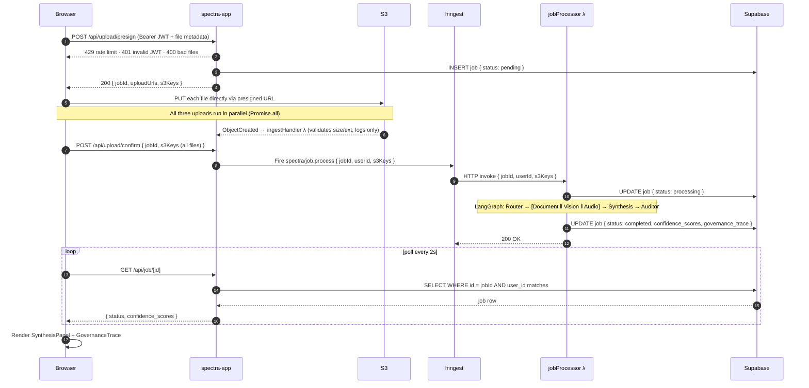
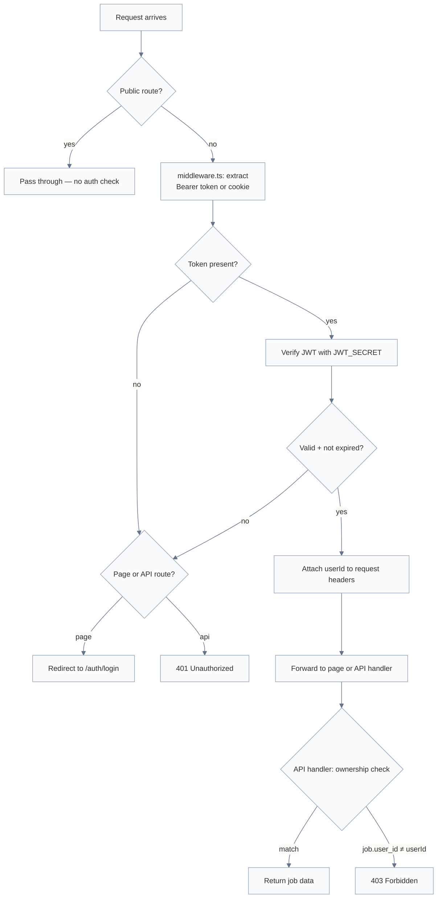
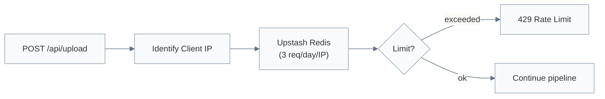
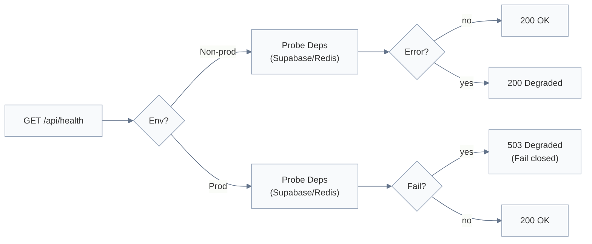
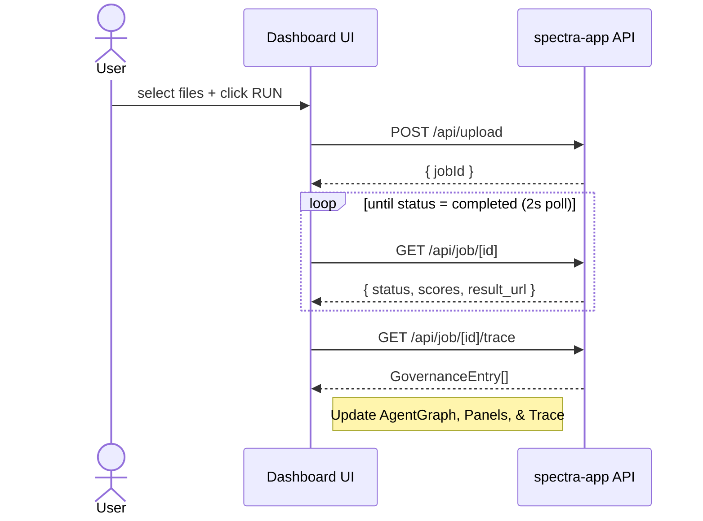

# 🌐 Spectra AI — Architecture Flows

This document captures the core runtime flows that define Spectra AI's current behavior.
Updated as each Phase ships — if a code change alters runtime behavior without updating this doc, treat that as an incomplete PR.

Use this file as the engineering source of truth for flow-level behavior.

---

## How to Read These Diagrams

- **UI** = dashboard and auth pages (Next.js 16, Vercel)
- **Middleware** = `middleware.ts` — JWT guard on all `/dashboard` and `/api` routes
- **/api/upload** = file validation, rate limiting, S3 presigned PUT; **/api/upload/confirm** = Inngest trigger (fires once after all files are uploaded, with full s3Keys)
- **Inngest** = job lifecycle (pending → processing → completed/failed), retries
- **Lambda** = `ingestHandler` (S3 trigger — validation/logging only, does NOT trigger Inngest) + `jobProcessor` (Inngest HTTP invocation)
- **LangGraph** = agent orchestration inside `jobProcessor`
- **Supabase** = job record storage, Auth, RLS
- **Upstash Redis** = rate limiting (frontend) + LangGraph checkpointing (Lambda)

Status code conventions used across flows:

- `400` malformed request payload
- `401` unauthenticated (missing or invalid JWT)
- `403` authenticated but not the job owner
- `429` rate limit exceeded — 3/day/IP on upload; 10/hr/IP on auth/token; 5/min/IP on auth/refresh; 60/min/IP on job read endpoints
- `501` not yet implemented (scaffold phase)
- `503` critical runtime dependency unavailable (production strict mode)

---

## 1) Main System Architecture

### Diagram



---

## 2) Upload → Agent Pipeline Flow

### Why this exists

The upload path spans four systems (Next.js → S3 → Lambda → LangGraph → Supabase) and two async boundaries (confirm endpoint → Inngest, Inngest → jobProcessor). The confirm endpoint is the sole Inngest trigger — it fires once after all files are uploaded and carries the full s3Keys payload. The `ingestHandler` Lambda validates and logs S3 events but does not trigger Inngest.

### What this flow guarantees

- Rate limit applied before any file processing — no backend cost on abuse.
- JWT ownership enforced at every API boundary.
- S3 receives files only after all validation passes.
- Job record created in Supabase before Lambda runs — frontend can poll immediately.
- Inngest owns retries; Lambda does not retry internally.
- Results written to Supabase atomically; frontend polls until `status === 'completed'`.

### Diagram



---

## 3) JWT Auth + Middleware Guard Flow

### Why this exists

Spectra AI separates unauthenticated public routes (landing, login) from protected dashboard and API routes. The middleware layer enforces this boundary before any page or handler executes.

### What this flow guarantees

- Unauthenticated users are redirected to `/auth/login` (pages) or receive `401` (API routes).
- Valid tokens pass actor identity through to downstream handlers for ownership checks.
- Public routes (`/`, `/auth/login`, `/api/auth/token`, `/api/inngest`, `/api/health`) are never blocked.

### Diagram



---

## 4) Rate Limiting Flow

### Why this exists

`/api/upload` triggers the full agent pipeline — Bedrock, OpenAI, Whisper, Lambda compute. Uncapped, a single abusive IP could drain the monthly cost ceiling in minutes. Rate limiting is the first check applied, before JWT validation or any file processing.

### What this flow guarantees

- 3 requests per day per IP, sliding window (Upstash Redis).
- Demo account subject to the same limit — no exceptions.
- Limit hit returns `429` immediately, no backend cost incurred.
- Real cost guard is the CloudWatch $15 billing alarm — rate limit is the first line of defence.

### Diagram



---

## 5) Runtime Strictness Policy (Health + Dependencies)

### Why this exists

Spectra AI must remain developer-friendly in non-production (missing env vars are tolerated) while being strict and predictable in production (missing or errored deps fail closed with `503`).

### What this flow guarantees

- Non-prod/CI allows degraded deps — supports local dev without all services wired.
- Production fails closed when Supabase or Redis are unavailable — no silent half-broken state.
- Health endpoint used by `scripts/verify-ready.mjs` and UptimeRobot.

### Diagram



---

## 6) Dashboard UI State Machine (Phase 3)

The dashboard manages a client-side state machine that drives all four output panels.

### State Variables

| State               | Type                | Description                                        |
| :------------------ | :------------------ | :------------------------------------------------- |
| `files`             | `UploadedFiles`     | Files loaded into each drop target                 |
| `jobId`             | `string \| null`    | Supabase job UUID once upload succeeds             |
| `jobStatus`         | `JobStatus \| null` | `pending → processing → completed \| failed`       |
| `agentStatuses`     | `AgentStatuses`     | Per-node status derived from jobStatus (see below) |
| `confidenceScores`  | `ConfidenceScores`  | `{ doc, vision, audio }` from Auditor node         |
| `governanceEntries` | `GovernanceEntry[]` | Full trace fetched on job completion               |
| `reportText`        | `string`            | Synthesis report text from `job.result_url`        |

### Job Status → Agent Status Mapping

```
jobStatus = 'pending'    → router: processing, others: idle
jobStatus = 'processing' → router: complete, doc/vision/audio: processing, synthesis: idle
jobStatus = 'completed'  → all nodes: complete
jobStatus = 'failed'     → statuses frozen at last known state
```

### Flow Diagram



---

## 7) Phase 4 Observability + Test Architecture

### Sentry Integration Points

Two separate Sentry SDKs are in use — they cannot share config:

| Location                                 | SDK                      | Init file                                             |
| :--------------------------------------- | :----------------------- | :---------------------------------------------------- |
| Next.js client (browser)                 | `@sentry/nextjs`         | `sentry.client.config.ts`                             |
| Next.js server + edge                    | `@sentry/nextjs`         | `sentry.server.config.ts`, `sentry.edge.config.ts`    |
| Lambda (`jobProcessor`, `ingestHandler`) | `@sentry/aws-serverless` | module-level `Sentry.init()` + `Sentry.wrapHandler()` |

`withSentryConfig()` in `next.config.ts` handles source-map upload and build-time instrumentation. It wraps the exported `NextConfig` — the raw config is not exported.

### Test Suite Layout

```
apps/spectra-app/tests/
├── api/
│   ├── upload/route.redteam.test.ts  # Rate limiting, S3 upload, JWT, 400/429 paths
│   ├── job/route.test.ts             # Ownership enforcement, 401/403/200/404 (6 tests)
│   ├── auth/route.test.ts            # Credential validation, JWT issuance (5 tests)
│   ├── health/route.test.ts          # Health endpoint — ok/degraded/503 semantics (7 tests)
│   ├── eval/route.test.ts            # Eval route (8 tests)
│   └── rateLimit.test.ts             # Rate limit sliding window across all 5 routes (30 tests)
├── lib/
│   └── authLogger.test.ts            # Structured auth event logging (3 tests)
└── e2e/
    ├── landing.spec.ts               # Public landing page smoke
    ├── login.spec.ts                 # Auth flow
    └── dashboard.spec.ts             # Gated — requires PLAYWRIGHT_RUN_E2E=true + live Supabase

apps/spectra-api/src/__tests__/
├── schemas.test.ts                   # 23 tests — all 6 agent node schemas (Router → Auditor)
├── red-team.redteam.test.ts          # 48 adversarial tests — injection patterns, PII redaction, synthesis guardrails
└── retrieval-eval.test.ts            # 13 tests — chunk quality filter, cosine deduplication, golden-set pipeline
```

Vitest picks up `**/*.test.ts` only. Playwright `.spec.ts` files are excluded from Vitest via explicit `exclude: ["tests/e2e/**"]` in `vitest.config.ts`.

Playwright `webServer` block starts the Next.js dev server and injects `NEXT_PUBLIC_SENTRY_DSN: ""` (prevents missing-DSN startup failure in CI) and a predictable `JWT_SECRET` so E2E helpers can issue valid tokens.

---

## 8) Phase 5 AWS Deployment Topology

### CDK Stack Deployment Order

Four stacks deploy in dependency order — CDK resolves this automatically via cross-stack exports:

```
SpectraStorageStack        (eu-west-1) → S3 bucket + lifecycle + CORS
SpectraComputeStack        (eu-west-1) → ingestHandler + jobProcessor Lambdas + IAM + Bedrock policy
SpectraObservabilityStack  (eu-west-1) → MetricFilters + Lambda error alarms + CloudWatch dashboard
SpectraBillingAlarmStack   (us-east-1) → billing alarm ($15) + SNS billing topic
```

`ObservabilityStack` and `BillingAlarmStack` are intentionally separate stacks in different regions. CDK (and CloudFormation) enforce that a `cloudwatch.Alarm` must live in the same region as its metric. `AWS/Billing EstimatedCharges` metrics only exist in `us-east-1`; Lambda log groups and MetricFilters must be in `eu-west-1` alongside the Lambdas. A single stack cannot satisfy both constraints — see `TECHNICAL_ADVISORY.md §20`.

The S3 → `ingestHandler` event notification is wired at app level (`bin/spectra-api.ts`) after both stacks are instantiated, avoiding a circular dependency between StorageStack and ComputeStack:

```ts
storageStack.uploadsBucket.addEventNotification(
  s3.EventType.OBJECT_CREATED,
  new s3n.LambdaDestination(computeStack.ingestHandler),
  { prefix: "uploads/" },
);
```

CDK exports the Lambda ARN from ComputeStack and imports it into the bucket notification in StorageStack. Deploy order: ComputeStack before StorageStack update.

**Bootstrap requirement:** `us-east-1` must be bootstrapped separately before first deploy:

```bash
cdk bootstrap aws://ACCOUNT_ID/us-east-1
```

### Lambda Configuration at Deployment

| Function                 | Memory  | Timeout | Concurrency                    |
| :----------------------- | :------ | :------ | :----------------------------- |
| `spectra-ingest-handler` | 256 MB  | 30s     | unreserved                     |
| `spectra-job-processor`  | 1024 MB | 300s    | unreserved (cap pending quota) |

`jobProcessor` concurrency is unreserved. A `reservedConcurrentExecutions: 1` cap can be added to `compute-stack.ts` once an AWS Service Quotas increase for concurrent executions is approved.

### Billing Alarm

CloudWatch `EstimatedCharges` metric only exists in `us-east-1`. `BillingAlarmStack` is therefore deployed exclusively to `us-east-1`. It has its own SNS topic (`spectra-billing-alerts`) and email subscription. Lambda error alarms live in `ObservabilityStack` (`eu-west-1`) with a separate SNS topic (`spectra-lambda-errors`).

After first deploy, two SNS confirmation emails are sent — one per topic, one per region. Both must be confirmed or alarms will not deliver email.

---

## 9) Phase 6 Hardening Architecture

### Prompt Injection Detection

`detectPromptInjection()` in `src/lib/prompt-injection.ts` is called on extracted text content before any LLM call in `documentNode` (PDF raw text) and `audioNode` (Whisper transcript). Matches against 14 regex patterns covering common injection techniques. Returns `{ safe: false, reason }` — the node throws immediately, failing the job with a structured error message rather than forwarding attacker-controlled text to Claude or GPT-4o.

Vision node is exempt — raw image bytes carry no injection surface before the model call.

### Synthesis Guardrails

`validateSynthesisReport()` in `synthesisNode.ts` runs post-parse, pre-auditor:

- Minimum 100-character report length (catches silent LLM failures)
- Injection pattern scan on LLM output (prevents prompt injection in synthesis response from propagating)
- Citation tag presence check `[DVA]\d+` — warns to CloudWatch if no inline citations found despite active modalities

### LangSmith Evaluators

Two named evaluators computed after every successful graph run in `jobProcessor.ts`:

| Evaluator           | Score derivation                                                 |
| :------------------ | :--------------------------------------------------------------- |
| `faithfulness`      | `overallFaithfulness / 100` from auditorNode                     |
| `citation_accuracy` | high-confidence findings (≥70%) / total governance trace entries |

Results logged as structured JSON to CloudWatch (`[langsmith-evaluators]` prefix). Future: push as LangSmith `createFeedback` calls once per-run trace IDs are captured.

### NIST AI RMF Control IDs

`AuditorOutputSchema.governanceTrace` entries carry an optional `nistControlId` field (e.g. `"MEASURE 2.1"`) alongside the existing `nistTag` function. The auditor prompt includes a 10-entry NIST AI RMF control reference table. The GovernanceTrace UI displays the full control ID when present, falling back to the function tag.

### Accessibility

All interactive and structural components hardened to WCAG 2.1 AA:

| Component                    | Change                                                                                                             |
| :--------------------------- | :----------------------------------------------------------------------------------------------------------------- |
| `AgentGraph`                 | `role="img"` on container, `aria-label` per node with status                                                       |
| `ConfidenceBar`              | `role="progressbar"` with `aria-valuenow/min/max`                                                                  |
| `UploadZone`                 | `role="button"` + `tabIndex` + `Enter`/`Space` keyboard handlers + `aria-label` on drop targets and remove buttons |
| `GovernanceTrace`            | `aria-expanded`, `role="table/row/cell/columnheader"`, `aria-controls`                                             |
| `SynthesisPanel`             | `aria-live="polite"` on report region; citation badges are keyboard-focusable `<button>` elements                  |
| `GlassPanel`                 | Optional `role` and `aria-label` props                                                                             |
| `SectionLabel`               | `role="heading"` `aria-level={3}`                                                                                  |
| `ModalityCard`               | `role="article"` with `aria-label`                                                                                 |
| `AzureButton`, `GhostButton` | `aria-disabled` on link (`<a>`) variants                                                                           |

---

## 10) Phase 8 Hardening Architecture

### Upload Flow — Presign → Direct S3 PUT → Confirm

The upload pipeline was refactored from server-side `PutObjectCommand` to a three-step presigned-URL flow:

```
Browser → /api/upload/presign  — validates file metadata, creates job (pending), returns signed PUT URLs (5-min TTL)
Browser → S3 (PUT)             — uploads each file directly; Vercel function never receives file bytes
Browser → /api/upload/confirm  — verifies job ownership, fires Inngest pipeline
```

This eliminates Vercel function memory pressure and egress cost. The old `/api/upload` route is retained for backwards compatibility. Rate limiting (3 req/day/IP, `rl:upload` prefix) is enforced at the presign step.

### Auth Rate Limiting

`/api/auth/token` now carries a separate Upstash sliding-window limit (10 attempts/hour/IP, `rl:auth` prefix), independent from the upload limiter. Prevents credential stuffing against the demo account.

### JWT Refresh

`/api/auth/refresh` accepts a valid Bearer token and re-issues a new 8h JWT. Bypassed in middleware (no auth check needed on the refresh route itself). Clients should call this before the current token's expiry window.

### Lambda Warmup

A CloudWatch Events scheduled rule (`spectra-jobprocessor-warmup`) fires every 5 minutes and invokes `jobProcessor`. The handler detects the `source: "aws.events"` field and returns immediately — no pipeline work is done. Eliminates 3–5s cold-start latency on the first post-idle invocation.

### CloudWatch Error Alarms

`ObservabilityStack` includes `MetricFilter` constructs that watch `/aws/lambda/spectra-ingest-handler` and `/aws/lambda/spectra-job-processor` for `[ERROR]`/`ERROR`/`Unhandled` log patterns. Each filter increments a custom `Spectra/Lambda` metric; alarms threshold at 1 occurrence per 5-minute window and fire to the `spectra-lambda-errors` SNS topic (eu-west-1). Lambda log groups are passed as construct references from `ComputeStack` props — not by name — to avoid a CloudFormation lookup failure on fresh deploys.

### Vector Lifecycle

`vector-cleanup.ts` deletes the `{jobId}_{userId}` namespace from Upstash regardless of pipeline state:

- Called after `completeJob()` on success
- Called in the catch block on failure (errors swallowed — cleanup never blocks job status)

This prevents orphaned chunks from accumulating when a job fails mid-pipeline.

### Retrieval Quality

Two improvements to the embedding pipeline in `documentNode.ts`:

| Improvement                  | Implementation                                                                               |
| :--------------------------- | :------------------------------------------------------------------------------------------- |
| Chunk quality filtering      | Chunks below 20 words (headers, fragments) filtered before embedding                         |
| Near-duplicate deduplication | Before each upsert, nearest-neighbour query; chunks scoring ≥ 0.97 cosine similarity skipped |

---

## Update Rules

Update this document whenever any of the following changes:

- Upload pipeline hand-off points or validation order
- Rate limiting algorithm, threshold, or scope
- JWT verification logic or protected route set
- Dependency strictness policy or health endpoint semantics
- Agent graph execution order or node responsibilities

---

## Suggested Companion Docs

- `CLAUDE.md` — development governance, build phases, TypeScript rules
- `docs/TECHNICAL_ADVISORY.md` — architecture tradeoffs and cost decisions
- `docs/HARDENING_ROADMAP.md` — post-launch hardening checklist
- `docs/OPERATIONS_RUNBOOK.md` — operational reference, CDK deploy steps, rollback guidance
- `docs/SECURITY_ADVISORY.md` — red team adversarial resilience advisory
